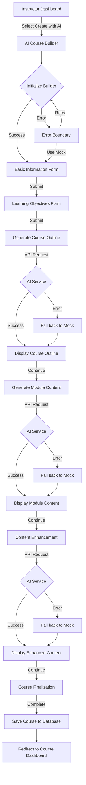
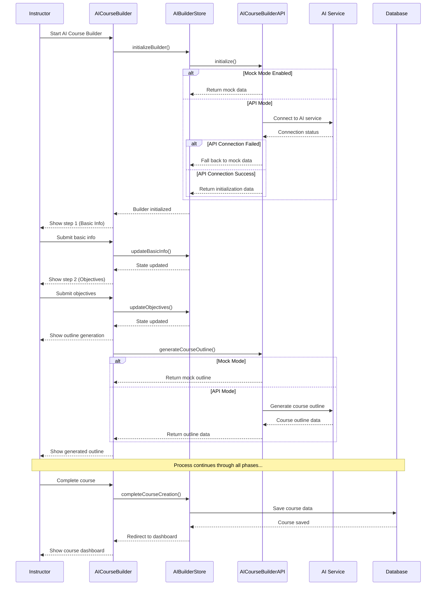
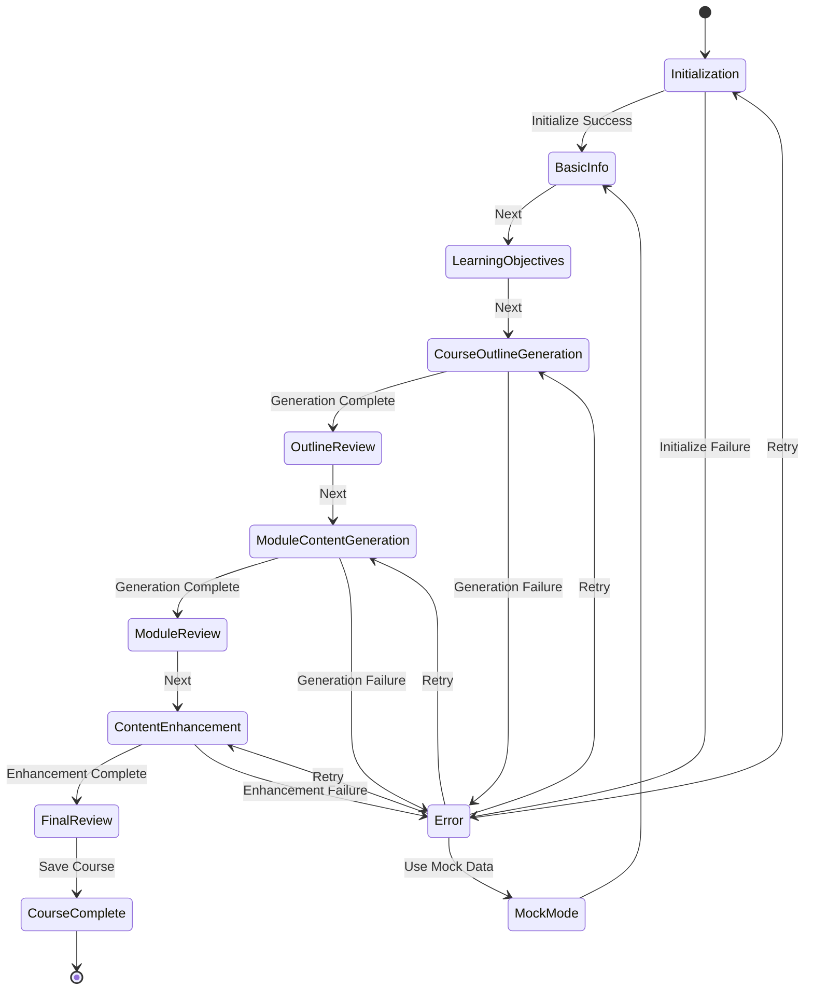
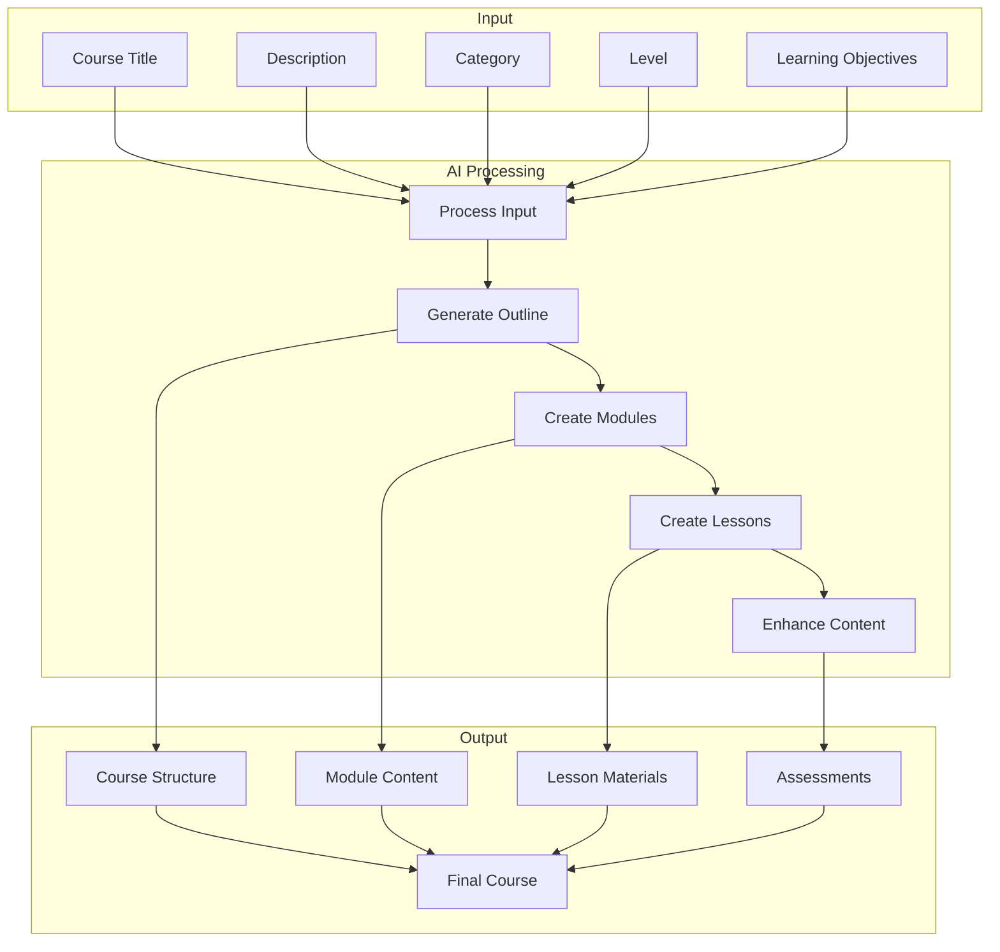
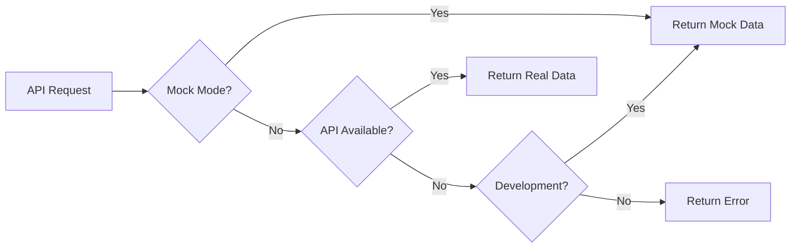

# AI Course Builder Flow Diagram

## Overview

This document provides a visual representation of the AI Course Builder workflow and component interactions.

## Component Interaction

## State Management Flow

## Data Flow

## Mock API Mode Behavior

This diagram illustrates how the AI Course Builder handles API requests in different scenarios, including the automatic fallback to mock responses during development.
